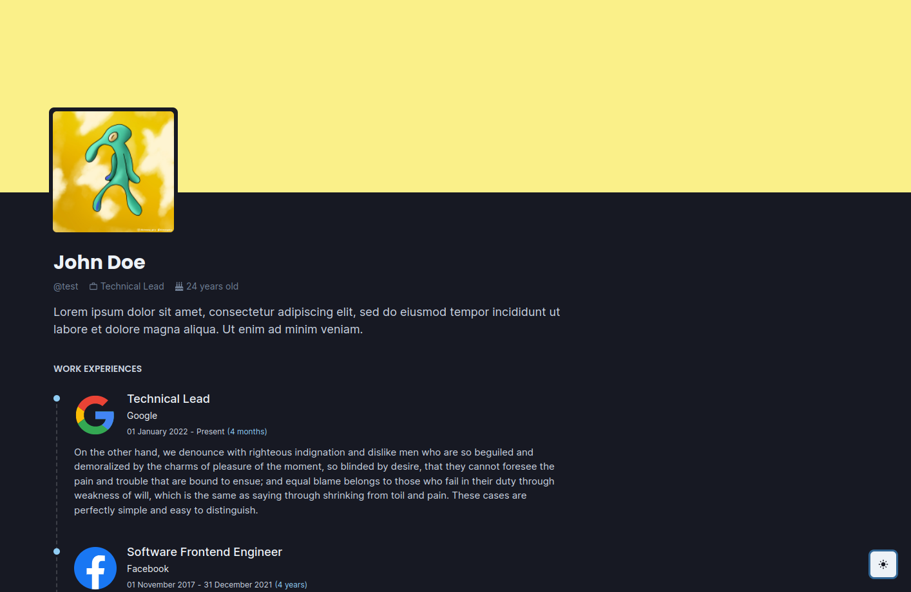

# Glints Frontend Test

Demo: [https://glints-fe-test-c4b95.web.app/](https://glints-fe-test-c4b95.web.app/)

## Tech Stack

This project was bootstrapped with:

- [React](https://reactjs.org/)
- [Firebase](https://firebase.google.com/)
- [TypeScript](https://www.typescriptlang.org/)
- [Vite](https://vitejs.dev/)
- [Chakra UI](https://chakra-ui.com/)
- [Recoil](https://recoiljs.org/)
- [ESLint](https://eslint.org/)

## Available Scripts

- `npm run dev` to run the app in development mode
- `npm run build` to build the project into static HTML files
- `npm run preview` to run build static HTML files
- `npm run fmt` to format and prettify codes

## Code Flow

### 1. React Components

Those are basically JSX components like button, input, navbar etc.

### 2. Custom Hooks

Those are used as the layer between React Component and Services to communicate. To keep the code clean, I decided to seperate theme instead of mixing every API calls and services into the components.

They usually return the service results and its calling state like `isLoading` and `error`. Custom Hooks could optionally call Store if the result of the service needs to be stored globally.

### 3. Store

Store is basically a global state manager to store states globally. Recoil is used as the global state manager in this project.
